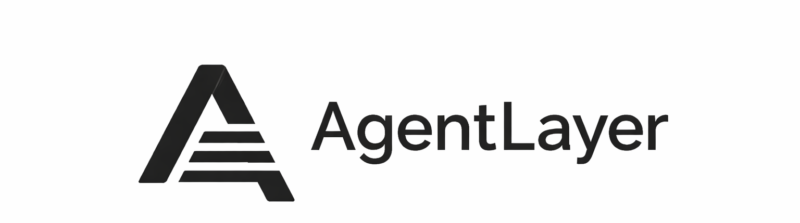

[](https://www.npmjs.com/package/@agentlayer.tech/wallet)
[](https://www.npmjs.com/package/@agentlayer.tech/wallet)
[](https://nodejs.org/)
[](https://docs.agent-layer.tech/)

## Install
Run one command:

```bash
npx --yes @agentlayer.tech/wallet@latest install
```
It works with:

- Codex
- Claude Code
- OpenClaw
- Hermes

You need:

- Node.js 24
- npm
- Python 3

AgentLayer detects the supported agent frameworks on your machine and asks
where you want to install the plugin.

Restart the selected applications after installation.

### Install automatically

To install into every detected framework without questions:

```bash
npx --yes @agentlayer.tech/wallet@latest install --yes
```

### Choose frameworks explicitly

```bash
npx --yes @agentlayer.tech/wallet@latest install --yes --hosts codex,claude-code
```

Supported host names are:

```text
codex
claude-code
openclaw
hermes
```

To see what AgentLayer detects:

```bash
npx --yes @agentlayer.tech/wallet@latest detect --json
```

## Update

If the `wallet` command is available:

```bash
wallet update --yes
```

If the CLI is missing or outdated:

```bash
npx --yes @agentlayer.tech/wallet@latest update --yes
```

An update refreshes the shared runtime and the frameworks already connected to
AgentLayer. It does not add a newly installed framework without your choice.

To update only selected frameworks:

```bash
npx --yes @agentlayer.tech/wallet@latest update --yes --hosts codex,claude-code
```

Preview an update without applying it:

```bash
wallet update --yes --dry-run
```

## Check the installation

```bash
wallet status
wallet doctor
```

## Universal local MCP

Any MCP client that supports the standard local `stdio` transport can use the
same wallet runtime, without installing a Codex, Claude Code, OpenClaw, or
Hermes plugin. Install the runtime, then print a ready-to-paste MCP config:

```bash
npx --yes @agentlayer.tech/wallet@latest install --yes --runtime-only
npx --yes @agentlayer.tech/wallet@latest mcp config
```

The generated config starts a local process at the stable
`agent-wallet-runtime/current` path. It exposes the same wallet tools as the
Codex and Claude Code bridges. Transaction policy, preview/prepare/execute,
and approval checks remain enforced by the shared Python wallet runtime.

For clients that ask for an executable path instead of JSON, use:

```bash
npx --yes @agentlayer.tech/wallet@latest mcp path
```

If the global CLI is not installed:

```bash
npx --yes @agentlayer.tech/wallet@latest status
npx --yes @agentlayer.tech/wallet@latest doctor
```

After an install or update, restart the connected agent applications when
`wallet status` shows `restart_required: true`.

## Hosted x402 payment MCP

Cloud-agent and mobile-host users can be served by the separate
[`x402-payment-mcp/`](x402-payment-mcp/README.md). It is a new remote MCP with
first-party OAuth (Google/GitHub login), one CDP-managed Base wallet per user,
CDP Bazaar-only discovery, and Base USDC x402 payments. It does not replace or
share custody assumptions with the local wallet runtime.

## Common commands

```bash
wallet detect --json
wallet status
wallet doctor
wallet update --yes
wallet rollback
```

## Optional connectors

Connectors add optional third-party crypto and DeFi read tools without moving
existing integrations such as Aave, Kamino, or Morpho out of the wallet core.

```bash
wallet connectors inspect ./connector.json
wallet connectors install ./connector.json --enable --yes
wallet connectors list
wallet connectors disable com.example.protocol
wallet connectors doctor
```

Enabled read-only connectors appear in OpenClaw and Codex after the host is
restarted. Write-capable connectors remain unavailable until their verified,
AgentLayer-hosted execution path is fully enabled. See
[`connectors/README.md`](connectors/README.md) for the trust model and protocol.

## What AgentLayer provides

AgentLayer connects supported agents to one local wallet runtime. The agent can:

- view balances and portfolio positions
- send and receive supported assets
- swap tokens
- use supported DeFi services
- access paid APIs through x402
- work with Solana, Ethereum, and Base

Read operations are available directly. Operations that move funds remain
protected by wallet policy and approval checks.


## Claude Code marketplace

Claude Code users can also install the plugin from its marketplace:

```text
/plugin marketplace add lopushok9/Agent-Layer
/plugin install agent-wallet@agentlayer
```

Restart Claude Code after installation.

## OpenClaw plugin

OpenClaw users can also install the native plugin from ClawHub:

```bash
openclaw plugins install clawhub:@agentlayertech/agent-wallet-plugin
```

The universal npm installer is still required to prepare the local wallet
runtime.

## Security

The agent receives wallet capabilities, not wallet keys.

- Keys and signing stay on the user's machine.
- Wallet secrets are encrypted locally.
- Updates preserve existing wallets and identities.
- Transactions remain subject to wallet policy and approvals.

On macOS, AgentLayer uses the login Keychain by default. macOS may ask for
Keychain access during an install or update. Approve it only when you initiated
the AgentLayer command.

Keep a secure offline copy of your recovery key.

## License

This repository is available under the PolyForm Small Business License 1.0.0.
Individuals, researchers, students, security reviewers, hobbyists, and eligible
small businesses may use and modify it under the terms of that license.
