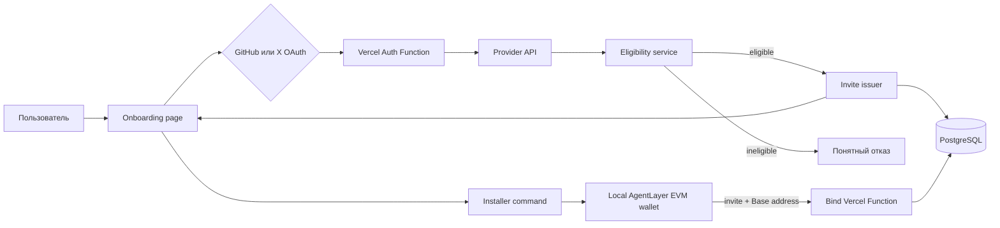

# План onboarding-системы: social verification → invite code → Base address

Дата: 2026-07-23

Статус: архитектурный план, без реализации

## 1. Цель

Создать простой и достаточно надёжный onboarding для нового пользователя
AgentLayer:

1. Пользователь открывает страницу onboarding на сайте.
2. Регистрируется через **один** из двух провайдеров: GitHub **или** X.
3. Backend получает подтверждённую provider identity и проверяет минимальные
   eligibility-условия.
4. Только прошедший проверку пользователь получает одноразовый invite code.
5. Пользователь передаёт invite code официальному installer.
6. Installer создаёт или открывает локальный EVM-кошелёк, получает его публичный
   адрес и привязывает invite к этому адресу.
7. Backend сохраняет однозначную связь:

   `verified social identity → invite → Base address`.

На этом данный план заканчивается. Перевод USDC, gas funding, x402-ограничения,
возврат средств и campaign treasury сюда не входят.

## 2. Зафиксированные продуктовые решения

- Единственная сеть кампании — **Base mainnet**.
- Для регистрации достаточно **GitHub или X**.
- Одновременное подключение GitHub и X не требуется.
- LinkedIn в первой версии отсутствует.
- Отдельная регистрация по email/password не нужна: успешный OAuth-вход и есть
  регистрация.
- Invite выдаётся только после server-side eligibility check.
- Endpoint привязки не проверяет verification повторно. Наличие invite в статусе
  `issued` уже означает, что проверка была успешно пройдена.
- `install_id` не участвует в authoritative flow и не хранится в invite-записи.
- Текущая anonymous telemetry не используется для определения адреса или
  подтверждения claim.
- Публичный Base address installer получает прямо из authoritative wallet
  backend, а не из telemetry.
- Не требуется отдельный постоянно работающий backend-сервис. Backend размещается
  в том же Vercel project, что и `landing`, в виде Vercel Functions.
- Persistent state хранится во внешнем PostgreSQL, подключённом к Vercel.
- Один social account может получить не более одного invite в рамках кампании.
- Один Base address может быть привязан не более чем к одному invite кампании.

## 3. Что уже есть в репозитории

### `landing/`

Сейчас это React + Vite frontend. В нём нет application backend и базы данных.
Vercel позволяет добавить server-side functions в `landing/api/`, не превращая
frontend-код в доверенную сторону и не поднимая отдельный сервис.

### Installer

В `agent-wallet/scripts/install_agent_wallet.py` уже существуют:

- `_bootstrap_evm_wallet(...)`;
- результат с публичным `address`;
- привязка одного EVM address к Base и Ethereum;
- финальный JSON с `evm_wallet`.

Для кампании используется только Base, но новый кошелёк создавать отдельно не
нужно: существующий EVM address является Base address.

Сейчас EVM provisioning сделан best-effort: его ошибка не прерывает всю
установку. Поэтому invite нельзя помечать использованным, пока installer не
получил валидный EVM address и backend не подтвердил binding.

### Telemetry

Текущая telemetry:

- anonymous;
- содержит случайный локальный `install_id`;
- не содержит Base address;
- не подтверждает social verification;
- по определению не является доверенным каналом claim.

Её можно использовать только для агрегированных продуктовых метрик. Добавлять в
неё invite code, social identity или wallet address не следует.

## 4. Рекомендуемая архитектура



Компоненты:

- `landing/src/` — только UI onboarding и управление браузерной сессией;
- `landing/api/auth/` — OAuth/session endpoints;
- `landing/api/onboarding/` — eligibility, invite issuance и wallet binding;
- `landing/api/_lib/` — server-only database, hashing, validation и provider
  helpers;
- PostgreSQL — источник истины для identities, decisions, invites и bindings;
- `bin/openclaw-agent-wallet.mjs` и `setup.sh` — передача invite installer;
- `agent-wallet/scripts/install_agent_wallet.py` — получение authoritative EVM
  address и вызов bind endpoint.

Файлы из `landing/api/` нельзя импортировать в `landing/src/`. Это должна быть
жёсткая граница между browser bundle и server-only code.

## 5. Выбор auth-слоя

### Рекомендация: Better Auth

Для первой реализации рекомендуется Better Auth, а не собственная реализация
OAuth-протокола:

- есть готовые GitHub и X providers;
- есть PostgreSQL adapter и миграции;
- поддерживаются server-side sessions;
- библиотека закрывает значительную часть OAuth state/cookie/token plumbing;
- можно запретить implicit account linking;
- provider tokens можно шифровать в базе.

Перед основной реализацией нужен короткий integration spike:

1. Смонтировать Better Auth на `/api/auth/*` в Vercel Function.
2. Проверить GitHub callback на stable development domain.
3. Проверить X callback и доступность нужных X API fields на выбранном тарифе.
4. Проверить работу cookies между Vite page и Vercel Function.

Если Better Auth не монтируется чисто в текущий Vite/Vercel layout, запасной
вариант — `oauth4webapi` в собственных Vercel Functions. Самостоятельно писать
PKCE, `state`, token exchange и callback validation без проверенной OAuth
библиотеки не рекомендуется.

### Настройки account linking

В первой версии:

- `disableImplicitLinking: true`;
- не объединять GitHub и X пользователей автоматически по email;
- не использовать email как provider identity;
- provider identity — это пара `(provider, provider_subject_id)`;
- смена username не создаёт нового пользователя, потому что numeric provider ID
  остаётся прежним.

Неявное объединение по email удобно, но создаёт account-takeover edge cases и не
нужно для модели «GitHub или X».

## 6. Полный пользовательский поток

### Шаг 1. Onboarding page

Новый route, например:

`https://www.agent-layer.tech/onboard`

Экран содержит:

- краткое описание $1 welcome bonus;
- пояснение, что бонус предназначен для Base/x402;
- две равноправные кнопки:
  - `Continue with GitHub`;
  - `Continue with X`;
- ссылку на privacy notice;
- отсутствие LinkedIn;
- отсутствие требования подключить оба аккаунта.

### Шаг 2. OAuth registration

Пользователь выбирает ровно одного провайдера.

Backend:

1. Начинает Authorization Code flow.
2. Создаёт transaction-specific `state` и PKCE `code_verifier`.
3. Использует PKCE `S256`.
4. Хранит временное состояние в защищённой server-side session или в
   `HttpOnly`, `Secure`, `SameSite=Lax` cookie.
5. Принимает callback только на заранее зарегистрированном точном URL.
6. Обменивает authorization code на provider access token только на сервере.
7. Получает профиль текущего authenticated user через provider API.

После callback browser получает только session cookie. Access token, client
secret и provider response не должны попадать в frontend.

### Шаг 3. Eligibility evaluation

Один endpoint, например:

`POST /api/onboarding/claim-invite`

Он:

1. Проверяет server-side session.
2. Находит provider account.
3. Получает свежие минимально необходимые provider signals.
4. Рассчитывает eligibility по versioned rules.
5. В одной транзакции:
   - сохраняет assessment;
   - проверяет отсутствие предыдущего claim;
   - создаёт invite;
   - сохраняет только hash кода.
6. Возвращает raw invite code один раз.

Frontend не передаёт `eligible: true`, follower count, account age или provider
ID. Все эти данные backend получает сам.

### Шаг 4. Показ install command

После успешной проверки frontend показывает:

```bash
npx @agentlayer.tech/wallet install --yes --invite alw_<secret>
```

Также нужны:

- отдельная кнопка `Copy command`;
- expiry time;
- предупреждение не публиковать код;
- кнопка `Replace lost code`, если пользователь потерял код до binding.

Raw invite нельзя помещать:

- в URL или query string;
- в `localStorage`;
- в analytics events;
- в session replay;
- в error reporting breadcrumbs;
- в server access logs.

Аргумент CLI может кратковременно оказаться в shell history и process list. Для
одноразового короткоживущего бонусного кода на $1 это допустимый MVP-компромисс.
Позже можно добавить интерактивный hidden prompt, не меняя backend protocol.

### Шаг 5. Installer создаёт кошелёк

Root CLI передаёт `--invite` через `setup.sh` в Python installer.

Python installer:

1. Выполняет обычную установку.
2. Вызывает существующий `_bootstrap_evm_wallet(...)`.
3. Берёт `evm_onboard_result["address"]`.
4. Проверяет формат локально.
5. Вызывает binding API.

В request не передаются private key, seed, wallet password, keystore path,
`user_id` локального runtime или `install_id`.

### Шаг 6. Binding

Endpoint:

`POST https://www.agent-layer.tech/api/onboarding/bind-wallet`

Request:

```http
Authorization: Bearer alw_<secret>
Content-Type: application/json
```

```json
{
  "address": "0x..."
}
```

`network` не нужен: данная кампания всегда Base. EVM address сам по себе не
содержит chain ID; принадлежность к Base задаётся campaign configuration.

Backend:

1. Извлекает invite из `Authorization`.
2. Вычисляет SHA-256.
3. Находит invite по `code_hash`.
4. Проверяет `status`, expiry и Base/EVM address format.
5. В транзакции привязывает address.
6. Возвращает идемпотентный результат.

Проверять `verification passed` здесь повторно не нужно. Invite мог быть создан
только `claim-invite` endpoint после eligible assessment.

### Шаг 7. Результат

Успех:

```json
{
  "ok": true,
  "status": "bound",
  "network": "base",
  "address": "0x..."
}
```

Повтор того же request:

```json
{
  "ok": true,
  "status": "already_bound",
  "network": "base",
  "address": "0x..."
}
```

## 7. Provider-specific verification

Eligibility rules должны находиться на backend и иметь версию, например
`github_v1` и `x_v1`. Thresholds нельзя компилировать во frontend.

### GitHub

Минимальные scopes:

- `read:user`;
- `user:email`, если проверяется primary verified email.

Authoritative identity:

- numeric GitHub user `id`, не username и не email.

Предлагаемые правила `github_v1`:

- account age не меньше 180 дней;
- account type — обычный user, не bot;
- существует primary verified email;
- присутствует хотя бы один минимальный history signal:
  - `public_repos > 0`, или
  - `followers > 0`.

Это не доказывает уникальность человека, но делает создание свежего пустого
аккаунта недостаточным.

### X

Минимальные scopes:

- `users.read`;
- `tweet.read`, если X требует его для выбранного OAuth flow;
- `users.email` только если реально доступен и нужен приложению;
- без `offline.access`, потому что постоянный доступ после assessment не нужен.

Authoritative identity:

- numeric X user `id`, не `username` и не email.

Запрашиваемые fields:

- `created_at`;
- `verified`;
- `public_metrics`.

Предлагаемые правила `x_v1`:

- account age не меньше 180 дней;
- `tweet_count >= 10`;
- `verified == true` или `followers_count >= 25`.

Thresholds являются стартовой product policy, а не протокольной истиной. Их
следует вынести в versioned server configuration и утвердить до реализации.

### Почему проверки отличаются

GitHub и X дают разные сигналы. Поскольку пользователь подключает только один
аккаунт, каждый provider-specific набор должен быть достаточным сам по себе.
Нельзя считать X `verified` или GitHub verified email доказательством
«один человек — один аккаунт»; это только стоимость злоупотребления.

## 8. Остаточная sybil-модель

MVP надёжно предотвращает:

- повторный claim одним и тем же GitHub account;
- повторный claim одним и тем же X account;
- повторное использование invite;
- привязку двух invite к одному Base address;
- подмену provider signals со стороны frontend;
- случайный повтор binding после network timeout.

MVP не может надёжно определить, что:

- GitHub account A и X account B принадлежат одному человеку;
- пользователь владеет несколькими старыми social accounts;
- пользователь купил aged social account;
- пользователь создаёт новый Base wallet для каждого claim.

Это прямое следствие требования «GitHub **или** X». Устранить cross-provider
double claim можно только дополнительным общим идентификатором, обязательной
привязкой обоих аккаунтов, KYC/passkey/phone verification или внешним
identity-risk сервисом. Для бонуса $1 отказ от этих усложнений является
осознанным решением.

Не рекомендуется добавлять IP ban как authoritative rule:

- он плохо работает за VPN, мобильными сетями и корпоративным NAT;
- создаёт false positives для реальных пользователей;
- не доказывает identity.

IP можно позже использовать только как агрегированный risk/velocity signal, не
как ключ пользователя.

## 9. Модель данных

Better Auth создаёт свои таблицы `user`, `session`, `account` и `verification`.
Поверх них нужны две campaign-specific таблицы.

### `onboarding_assessments`

| Поле | Назначение |
|---|---|
| `id` UUID PK | ID assessment |
| `campaign_id` text | Например `welcome_base_v1` |
| `user_id` UUID FK | Better Auth user |
| `provider` text | `github` или `x` |
| `provider_subject_id` text | Immutable numeric provider ID |
| `rules_version` text | `github_v1` или `x_v1` |
| `decision` text | `eligible`, `ineligible`, `error` |
| `reason_code` text nullable | Машиночитаемая причина |
| `account_created_at` timestamptz | Нужный age signal |
| `signals` jsonb | Только минимальный набор eligibility signals |
| `evaluated_at` timestamptz | Время решения |

Ограничение:

```text
UNIQUE (campaign_id, provider, provider_subject_id)
```

Не нужно хранить bio, список email, tweets, repositories или полный provider
profile.

### `onboarding_invites`

| Поле | Назначение |
|---|---|
| `id` UUID PK | Internal invite ID |
| `campaign_id` text | `welcome_base_v1` |
| `user_id` UUID FK | Verified local user |
| `assessment_id` UUID FK UNIQUE | Eligible assessment |
| `code_hash` char(64) UNIQUE | SHA-256 от raw invite |
| `status` text | `issued`, `bound`, `expired`, `revoked` |
| `expires_at` timestamptz | Рекомендуемо 7 дней |
| `base_address` varchar(42) nullable | Нормализованный address |
| `created_at` timestamptz | Время выдачи |
| `bound_at` timestamptz nullable | Время binding |

Ограничения:

```sql
ALTER TABLE onboarding_invites
ADD CONSTRAINT onboarding_invites_campaign_user_unique
UNIQUE (campaign_id, user_id);

CREATE UNIQUE INDEX onboarding_invites_campaign_address_unique
ON onboarding_invites (campaign_id, lower(base_address))
WHERE base_address IS NOT NULL;
```

`wallet_network` не нужен, пока кампания Base-only.

`verified_user_id` дублировать не нужно: это `user_id`.

`install_id` не нужен.

### Retention

- provider access/refresh tokens удалить или занулить сразу после assessment;
- если библиотека временно хранит tokens, включить encryption at rest;
- session records удалять по expiry;
- ineligible assessments хранить ограниченный срок, достаточный для защиты от
  немедленного повторного claim;
- invites и bindings хранить на срок кампании плюс период аудита;
- raw invite никогда не хранить в базе.

## 10. Генерация и восстановление invite

Формат:

```text
alw_<base64url(32 random bytes)>
```

Правила:

- CSPRNG;
- не меньше 192 bits entropy, рекомендуется 256 bits;
- SHA-256 вычисляется до записи в PostgreSQL;
- raw value возвращается только в response выдачи;
- срок жизни по умолчанию — 7 дней;
- code одноразовый.

Поскольку raw code не хранится, backend не может показать тот же код повторно.
Если пользователь потерял его:

1. Пользователь всё ещё должен иметь valid authenticated session или снова
   пройти OAuth тем же provider account.
2. Нажимает `Replace lost code`.
3. Backend в транзакции заменяет `code_hash`, обновляет expiry и возвращает новый
   raw code.
4. Старый код сразу становится недействительным.

После `bound` ротация запрещена.

## 11. Binding state machine и идемпотентность

```text
eligible assessment
        |
        v
      issued ---- expiry/revoke ----> expired/revoked
        |
        | first valid Base address
        v
      bound
```

Поведение bind endpoint:

| Ситуация | HTTP | Результат |
|---|---:|---|
| Valid issued code + новый address | 200 | `bound` |
| Тот же code + тот же address | 200 | `already_bound` |
| Тот же code + другой address | 409 | `invite_already_bound` |
| Другой code + уже занятый address | 409 | `address_already_used` |
| Истёкший code | 410 | `invite_expired` |
| Revoked code | 410 | `invite_revoked` |
| Неизвестный/невалидный code | 401 | `invalid_invite` |
| Невалидный address | 400 | `invalid_base_address` |
| Временная DB/network ошибка | 503 | `retryable_error` |

Binding должен выполняться транзакционно. Предпочтительный вариант:

1. `SELECT ... FOR UPDATE` invite по `code_hash`;
2. сравнить current status/address;
3. нормализовать address;
4. выполнить conditional `UPDATE`;
5. положиться также на unique index по campaign/address;
6. commit;
7. вернуть детерминированный ответ.

Идемпотентность критична: installer может не получить response после успешного
commit и отправить тот же request повторно.

## 12. Валидация Base address

Backend принимает только:

- строку;
- `0x` + 40 hex symbols;
- не zero address;
- адрес, успешно нормализованный проверенной EVM-библиотекой, например `viem`;
- максимальный request body небольшого фиксированного размера.

В базе хранится одна каноническая форма, рекомендуемо lowercase. В response/UI
можно показывать checksum representation.

Address не доказывает сеть. Один и тот же EVM address может использоваться на
разных EVM chains. Поэтому Base — свойство `campaign_id`, а не проверка,
извлекаемая из address.

Подпись сообщения адресом в MVP не требуется:

- installer получает address непосредственно из локального authoritative wallet
  backend;
- backend решает задачу привязки invite к адресу, а не универсального
  доказательства владения внешним кошельком;
- подпись сама по себе не докажет, что social account и кошелёк принадлежат
  одному человеку, если invite уже украден.

Если позднее появится ручной ввод внешнего address через сайт, для такого потока
нужно отдельно добавить nonce + EIP-191/EIP-712 signature verification.

## 13. Изменения installer

Планируемые точки изменения:

### `bin/openclaw-agent-wallet.mjs`

- документировать `--invite <code>`;
- передавать аргумент в `setup.sh`;
- гарантировать, что telemetry получает только имя команды и status, но не
  аргументы или code;
- редактировать invite из error messages;
- добавить retry-команду `bind-invite`, если binding не завершился.

### `setup.sh`

Существующий `"$@"` уже передаёт аргументы Python installer. Отдельной логики
для invite здесь быть не должно.

### `agent-wallet/scripts/install_agent_wallet.py`

- добавить parser argument `--invite`;
- после успешного `_bootstrap_evm_wallet(...)` взять `address`;
- вызвать небольшой изолированный helper `bind_onboarding_invite(...)`;
- отправить только invite и address;
- использовать короткий timeout и ограниченные retries;
- не писать code в stdout/stderr/JSON result;
- вернуть только безопасный `invite_binding.status`.

Пример безопасного результата installer:

```json
{
  "evm_wallet": {
    "ok": true,
    "address": "0x..."
  },
  "invite_binding": {
    "ok": true,
    "status": "bound",
    "network": "base"
  }
}
```

### Если EVM provisioning не удался

- общая wallet installation остаётся успешной согласно текущей архитектуре;
- invite не расходуется;
- пользователь видит понятное предупреждение;
- после появления EVM wallet выполняет:

```bash
npx @agentlayer.tech/wallet bind-invite alw_<secret>
```

`bind-invite` получает существующий address из authoritative EVM backend и
повторяет тот же idempotent API request.

Raw invite не сохраняется локально автоматически. Если пользователь потерял код,
он выпускает замену на onboarding page.

## 14. Vercel deployment

### Functions

Предлагаемая структура:

```text
landing/
├── api/
│   ├── auth/
│   │   └── [...all].js
│   ├── onboarding/
│   │   ├── claim-invite.js
│   │   ├── replace-invite.js
│   │   └── bind-wallet.js
│   └── _lib/
│       ├── auth.js
│       ├── db.js
│       ├── eligibility.js
│       ├── invites.js
│       └── validation.js
└── src/
    └── ...
```

Использовать Node.js runtime, а не Edge runtime, чтобы упростить PostgreSQL и
auth library compatibility.

### PostgreSQL

Подходящие варианты из Vercel Marketplace:

- Neon — рекомендуемый default для этого проекта;
- Supabase Postgres.

Neon предпочтителен при отсутствии уже существующего Supabase project:
serverless Postgres и database branching хорошо подходят для разделения Vercel
Preview и Production. Если Supabase уже используется командой, отдельная смена
провайдера ради этого небольшого backend не оправдана.

Критерии выбора:

- managed backups;
- SSL;
- serverless-friendly pooling/driver;
- регион рядом с Vercel Function;
- отдельные production и preview databases или branches;
- понятная цена при небольшом трафике.

Если используется `pg`:

- pool создаётся на module/global scope;
- используется Vercel `attachDatabasePool`;
- connection всегда освобождается;
- idle timeout небольшой;
- `max=1` не выставляется как псевдооптимизация;
- schema migrations выполняются отдельной release-командой, не на каждый
  request.

### Environment variables

Server-only:

```text
DATABASE_URL
BETTER_AUTH_SECRET
BETTER_AUTH_URL
GITHUB_CLIENT_ID
GITHUB_CLIENT_SECRET
X_CLIENT_ID
X_CLIENT_SECRET
ONBOARDING_CAMPAIGN_ID
ONBOARDING_INVITE_TTL_SECONDS
```

Ни один секрет не должен иметь префикс `VITE_`: Vite-переменные доступны
browser bundle.

Production и preview должны использовать разные:

- databases;
- auth secrets;
- OAuth apps/credentials;
- campaign IDs.

Из-за строгих callback URL не следует подключать production OAuth app ко всем
случайным Vercel Preview URLs. Для тестирования нужен стабильный staging domain
и отдельные GitHub/X apps.

## 15. HTTP и application security

- Только HTTPS.
- Authorization Code flow, не implicit flow.
- PKCE `S256` и transaction-specific `state`.
- Exact callback allowlist.
- Никаких open redirect parameters вроде произвольного `returnTo`.
- Если нужен `returnTo`, разрешать только внутренние известные paths.
- Session cookie: `HttpOnly`, `Secure`, `SameSite=Lax`, короткий разумный TTL.
- OAuth client secrets только в Vercel sensitive environment variables.
- Provider tokens не отправлять в browser.
- Provider tokens не логировать и удалить после assessment.
- Better Auth token encryption включить как defense in depth.
- Implicit account linking выключить.
- `Cache-Control: no-store` на onboarding API responses.
- Не включать raw invite в URL.
- Не писать request `Authorization` header в application logs.
- Отключить или замаскировать session replay на блоке с invite.
- Ограничить body size и method.
- Использовать generic error для неизвестного invite, не раскрывая существование
  записей.
- Rate limit — мягкая дополнительная защита, а не identity mechanism.

Base address публичен onchain, но связь `social identity → address` является
чувствительной пользовательской информацией. Она доступна только backend и
административному audit tooling, не frontend bundle и не public API.

## 16. Практический опыт других систем

### AgentCash

Публично наблюдаемый паттерн AgentCash совпадает с выбранной границей:

- web onboarding оценивает подключённые accounts;
- результатом onboarding является invite/bonus eligibility;
- CLI поддерживает `onboard [code]`, `redeem <code>` и `--invite <code>`;
- MCP surface содержит отдельный `redeem_invite`;
- terms прямо упоминают linked-account review, scoring, duplicate detection и
  claim history.

Из публичной документации нельзя достоверно узнать внутреннюю schema, точный
risk score или транзакционную реализацию AgentCash. Поэтому их flow используется
как подтверждение UX-паттерна «web verification → one-time code → local wallet»,
а не как спецификация нашего backend.

### Повторяющиеся operational issues

Проблемы, для которых провайдеры и Vercel имеют отдельные официальные
troubleshooting guides, нужно считать ожидаемыми:

- GitHub `redirect_uri_mismatch`;
- GitHub expired/reused authorization code;
- GitHub user без доступного primary email;
- X `401` из-за неверного auth context/token;
- X `403` из-за недоступного scope или product tier;
- X `429`, требующий учёта `x-rate-limit-reset` и backoff;
- исчерпание PostgreSQL connections в serverless;
- различающиеся environment variables/migrations в preview и production;
- network timeout после успешного DB commit.

Архитектурные последствия:

- provider errors должны иметь отдельные user-safe reason codes;
- OAuth flow можно начать заново без ручной очистки аккаунта;
- profile fetch выполняется один раз на assessment, а не на каждый page load;
- X включается feature flag после реальной проверки тарифа и scopes;
- DB binding идемпотентен;
- schema migration является частью deployment checklist.

## 17. API contracts

### `POST /api/onboarding/claim-invite`

Auth: Better Auth session cookie.

Request body:

```json
{}
```

Success:

```json
{
  "eligible": true,
  "provider": "github",
  "invite": "alw_<secret>",
  "expiresAt": "2026-07-30T12:00:00Z"
}
```

Ineligible:

```json
{
  "eligible": false,
  "reason": "account_too_new"
}
```

Allowed public reason codes:

- `account_too_new`;
- `insufficient_history`;
- `verified_email_required`;
- `provider_temporarily_unavailable`;
- `already_claimed`.

Не возвращать thresholds или raw provider snapshot, если это помогает
автоматизировать обход.

### `POST /api/onboarding/replace-invite`

Auth: session cookie.

Разрешён только для существующего `issued` invite. Атомарно инвалидирует старый
code hash и возвращает новый raw code.

### `POST /api/onboarding/bind-wallet`

Auth: raw invite в Bearer header.

Body:

```json
{
  "address": "0x..."
}
```

Endpoint публично доступен из CLI, но защищён entropy invite, status checks,
expiry, unique constraints и bounded rate limit.

## 18. Порядок реализации

### Phase 0. Provider и infrastructure setup

- выбрать Neon или Supabase Postgres;
- создать отдельные dev/staging/prod databases;
- создать GitHub OAuth App для staging и production;
- создать X App для staging и production;
- зарегистрировать точные callbacks;
- проверить X pricing/access для `/2/users/me`;
- завести Vercel sensitive env variables;
- определить stable staging domain.

Результат: credentials и DB готовы, frontend ещё не изменён.

### Phase 1. Auth foundation

- установить Better Auth;
- добавить PostgreSQL adapter и migrations;
- смонтировать `/api/auth/*`;
- настроить GitHub и X;
- отключить implicit linking;
- включить token encryption;
- реализовать `/onboard` session UI;
- добавить feature flags для providers.

Рекомендуемый rollout: сначала GitHub, затем X после live callback/rate-limit
проверки. В финальном UI оба работают как альтернативы.

### Phase 2. Eligibility и invite issuance

- добавить custom tables и constraints;
- реализовать provider signal adapters;
- утвердить `github_v1` и `x_v1`;
- реализовать `claim-invite`;
- генерировать 256-bit invite;
- хранить только SHA-256;
- реализовать `replace-invite`;
- добавить UI для результата и copy command;
- исключить invite из analytics/session replay/logging.

### Phase 3. Installer binding

- добавить `--invite` в Node CLI help;
- добавить аргумент в Python parser;
- после EVM bootstrap вызвать bind endpoint;
- реализовать address validation;
- добавить bounded timeout/retry;
- добавить `bind-invite` recovery command;
- не менять wallet signing/policy architecture;
- не отправлять `install_id`;
- не отправлять private wallet data.

### Phase 4. Hardening и rollout

- concurrency tests;
- provider failure tests;
- preview/prod isolation check;
- log/secrets audit;
- data retention job;
- dashboards только по агрегированным status counts;
- небольшой canary rollout;
- ручная проверка первых claims;
- после стабильности включить X для всех.

## 19. Тестовый план

### OAuth

- GitHub happy path.
- X happy path.
- Отказ пользователя на consent screen.
- Неверный `state`.
- Неверный PKCE verifier.
- Повтор callback code.
- Expired callback code.
- Callback на незарегистрированный URL.
- Попытка open redirect.
- GitHub private primary email.
- X без email.
- Смена username при том же provider ID.
- Попытка implicit link по совпавшему email.
- X `401`, `403`, `429`, `5xx`.

### Eligibility

- account ровно на threshold boundary.
- старый пустой account.
- новый активный account.
- повторная оценка того же provider identity.
- конкурентные `claim-invite` requests.
- GitHub и X как независимые альтернативы.
- правила v1 остаются воспроизводимыми после появления v2.

### Invite

- raw code отсутствует в DB.
- разные codes имеют разные hashes.
- expired invite не binding-ится.
- replacement инвалидирует старый code.
- bound invite нельзя заменить.
- два concurrent bind request с одним code.
- один code с двумя addresses.
- два codes с одним address.
- неизвестный и malformed code.

### Installer

- новый EVM wallet и успешный bind.
- уже существующий EVM wallet и успешный bind.
- EVM provisioning failure — invite остаётся `issued`.
- backend timeout до commit.
- backend timeout после commit.
- повтор через `bind-invite`.
- invalid local address.
- invite не попадает в installer JSON, telemetry, stdout и stderr.
- обычная установка без `--invite` не меняет поведение.

### Deployment

- Vite browser bundle не содержит secrets.
- preview использует preview DB и OAuth apps.
- production использует production DB и OAuth apps.
- migrations применены до traffic switch.
- function и DB находятся в близких регионах.
- pool не создаётся заново на каждый request.

## 20. Наблюдаемость

Разрешённые агрегированные метрики:

- OAuth starts/success/failure по provider;
- eligibility eligible/ineligible/error по rules version;
- invites issued/replaced/expired/bound;
- binding latency и error category;
- EVM provisioning succeeded/failed;
- X rate-limit/provider errors.

Запрещённые поля в telemetry/logs:

- raw invite;
- OAuth access/refresh token;
- provider email;
- full provider profile;
- wallet private data;
- связь social identity → address в обычных product analytics.

Для расследования конкретного claim использовать audit query по internal invite
ID с ограниченным административным доступом.

## 21. Acceptance criteria

Система готова к следующему этапу, когда:

- пользователь может выбрать GitHub или X;
- LinkedIn отсутствует;
- OAuth secrets не попадают во frontend;
- backend сам получает provider identity и signals;
- eligibility rules versioned и протестированы;
- один provider account не получает второй invite кампании;
- invite создаётся только после eligible decision;
- raw invite хранится только у пользователя, в DB есть только hash;
- installer получает authoritative EVM/Base address;
- `bind-wallet` сохраняет address транзакционно и идемпотентно;
- повтор одного request безопасен;
- один address нельзя использовать для двух invites;
- `install_id` и telemetry не участвуют в claim;
- EVM provisioning failure не расходует invite;
- private keys и wallet secrets никогда не покидают устройство;
- production и preview полностью разделены;
- механика USDC ещё не добавлена.

## 22. Решения, которые нужно утвердить перед кодом

Неблокирующие архитектуру, но требующие product decision:

1. Финальные thresholds `github_v1` и `x_v1`.
2. Invite TTL: предлагаемое значение — 7 дней.
3. Подтвердить Neon как default либо использовать уже существующий Supabase.
4. Stable staging domain.
5. Точный production origin: с `www` или без него.
6. Campaign ID, например `welcome_base_v1`.
7. Срок хранения ineligible assessments и completed bindings.
8. Включать ли X сразу или после GitHub canary.

## 23. Источники

OAuth и providers:

- [OAuth 2.0 Security Best Current Practice, RFC 9700](https://datatracker.ietf.org/doc/html/rfc9700)
- [GitHub: Authorizing OAuth apps](https://docs.github.com/en/apps/oauth-apps/building-oauth-apps/authorizing-oauth-apps)
- [GitHub: OAuth troubleshooting](https://docs.github.com/en/apps/oauth-apps/maintaining-oauth-apps/troubleshooting-oauth-app-access-token-request-errors)
- [GitHub: REST API endpoints for emails](https://docs.github.com/en/rest/users/emails)
- [X: OAuth 2.0 Authorization Code with PKCE](https://docs.x.com/fundamentals/authentication/oauth-2-0/authorization-code)
- [X: Authenticated user lookup](https://docs.x.com/x-api/users/lookup/introduction)
- [X: Rate limits](https://docs.x.com/x-api/fundamentals/rate-limits)
- [X: Response codes and operational errors](https://docs.x.com/x-api/fundamentals/response-codes-and-errors)

Auth library:

- [Better Auth: Installation](https://better-auth.com/docs/installation)
- [Better Auth: GitHub provider](https://better-auth.com/docs/authentication/github)
- [Better Auth: X provider](https://better-auth.com/docs/authentication/twitter)
- [Better Auth: PostgreSQL](https://better-auth.com/docs/adapters/postgresql)
- [Better Auth: Account options and linking](https://better-auth.com/docs/reference/options)

Vercel и storage:

- [Vercel Functions](https://vercel.com/docs/functions)
- [Vite on Vercel](https://vercel.com/docs/frameworks/frontend/vite)
- [Vercel Marketplace Storage](https://vercel.com/docs/marketplace-storage)
- [Connection pooling with Vercel Functions](https://vercel.com/kb/guide/connection-pooling-with-functions)
- [Vercel environment variables](https://vercel.com/docs/environment-variables)

Сравниваемый onboarding flow:

- [AgentCash CLI overview](https://agentcash.dev/docs/cli/overview)
- [AgentCash MCP mode](https://agentcash.dev/docs/mcp-mode)
- [AgentCash wallet overview](https://agentcash.dev/docs/wallet/overview)
- [AgentCash supplemental terms](https://www.merit.systems/agentcash-terms)
