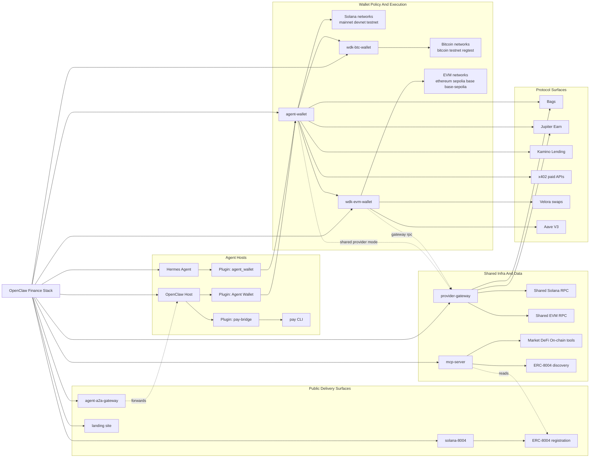

# OpenClaw Repo Presentation Schema

## Reading Guide

- `agent-wallet` is the control center: policy, approvals, backend selection, Solana execution.
- `wdk-btc-wallet` and `wdk-evm-wallet` are separate localhost runtimes for non-Solana assets.
- `provider-gateway` is shared infra for RPC and selected protocol relays, not a signer.
- `mcp-server` is a read-oriented agent data plane for prices, DeFi, on-chain lookups, gas, search, and ERC-8004 discovery.
- `.openclaw` and `hermes/plugins/agent_wallet` are thin bridges that expose tool surfaces to different agent hosts.
